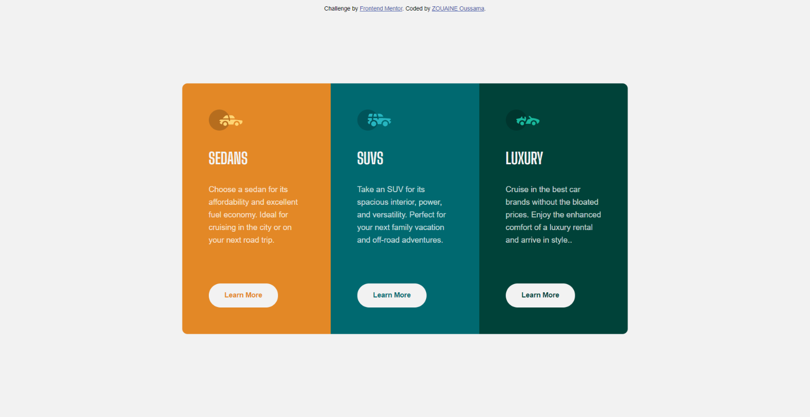

# Frontend Mentor - 3-column preview card component solution

This is a solution to the [3-column preview card component challenge on Frontend Mentor](https://www.frontendmentor.io/challenges/3column-preview-card-component-pH92eAR2-). Frontend Mentor challenges help you improve your coding skills by building realistic projects.

## Overview

### Screenshot

### Links

-   Solution URL: [Solution file](https://github.com/OussamaZouaine/Front-end-mentor-challenges/tree/main/3-column-preview-card-component-main)
-   Live Site URL: [The live site](https://oussamazouaine.github.io/Front-end-mentor-challenges/3-column-preview-card-component-main/index.html)
