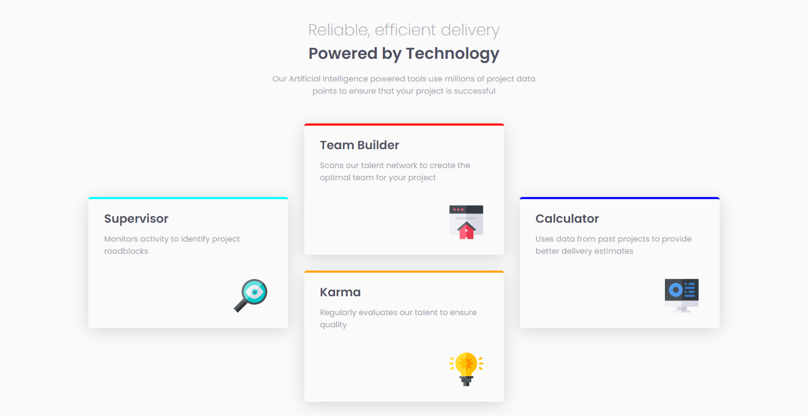

# Frontend Mentor - Four card feature section solution

This is a solution to the [Four card feature section challenge on Frontend Mentor](https://www.frontendmentor.io/challenges/four-card-feature-section-weK1eFYK). Frontend Mentor challenges help you improve your coding skills by building realistic projects.

## Overview

### Screenshot

### Links

-   Solution URL: [Solution file](https://github.com/OussamaZouaine/Front-end-mentor-challenges/tree/main/four-card-feature-section-master)
-   Live Site URL: [The live site](https://github.com/OussamaZouaine/Front-end-mentor-challenges/tree/main/four-card-feature-section-master/index.html)
