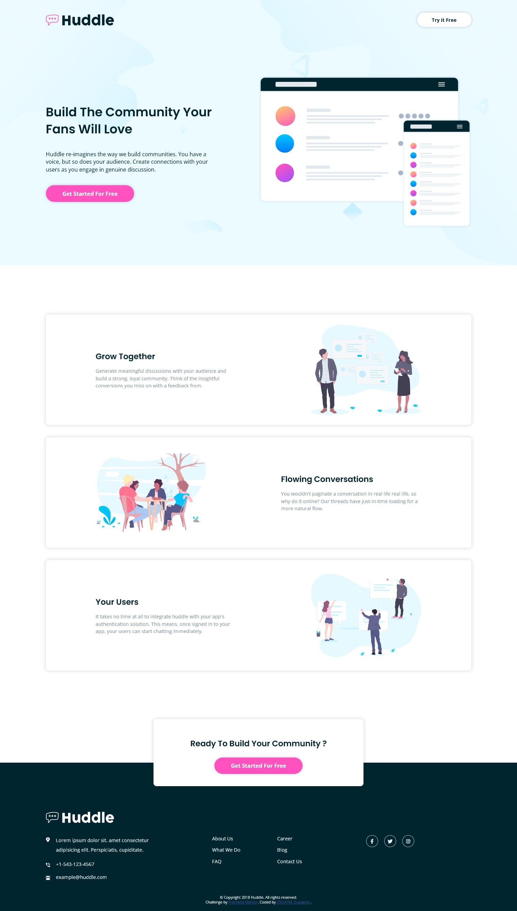

# Frontend Mentor - Huddle landing page with alternating feature blocks solution

This is a solution to the [Huddle landing page with alternating feature blocks challenge on Frontend Mentor](https://www.frontendmentor.io/challenges/huddle-landing-page-with-alternating-feature-blocks-5ca5f5981e82137ec91a5100). Frontend Mentor challenges help you improve your coding skills by building realistic projects.

## Overview

### The challenge

Users should be able to:

-   View the optimal layout for the site depending on their device's screen size
-   See hover states for all interactive elements on the page

### Screenshot

| Desktop                                   | Mobile                                               |
| ----------------------------------------- | ---------------------------------------------------- |
|  |  |

### Links

-   Solution URL: [Solution file](https://github.com/OussamaZouaine/Front-end-mentor-challenges/tree/main/huddle-landing-page-with-alternating-feature-blocks-master)
-   Live Site URL: [The live site](https://oussamazouaine.github.io/Front-end-mentor-challenges/huddle-landing-page-with-alternating-feature-blocks-master/index.html)
