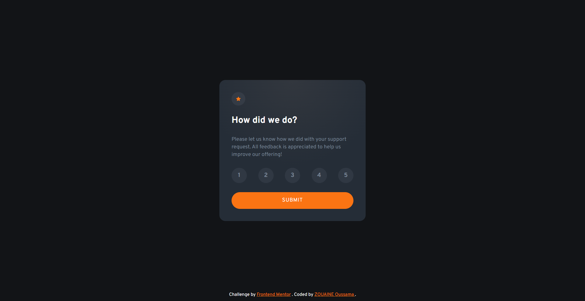
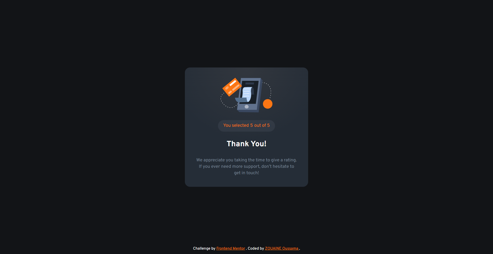

# Frontend Mentor - Interactive rating component solution

This is a solution to the [Interactive rating component challenge on Frontend Mentor](https://www.frontendmentor.io/challenges/interactive-rating-component-koxpeBUmI). Frontend Mentor challenges help you improve your coding skills by building realistic projects.

## Overview

### The challenge

Users should be able to:

-   View the optimal layout for the app depending on their device's screen size
-   See hover states for all interactive elements on the page
-   Select and submit a number rating
-   See the "Thank you" card state after submitting a rating

### Screenshot

| Rating Page                          | Thank You Page                         |
| ------------------------------------ | -------------------------------------- |
|  |  |

### Links

-   Solution URL: [Solution File](https://github.com/OussamaZouaine/Front-end-mentor-challenges/tree/main/interactive-rating-component-main)
-   Live Site URL: [The live site](https://oussamazouaine.github.io/Front-end-mentor-challenges/interactive-rating-component-main/index.html)

## My process

### Built with

-   Semantic HTML5 markup
-   CSS
-   Mobile-first workflow
-   JS
-   [Tailwindcss](https://tailwindcss.com/) - CSS Framework
