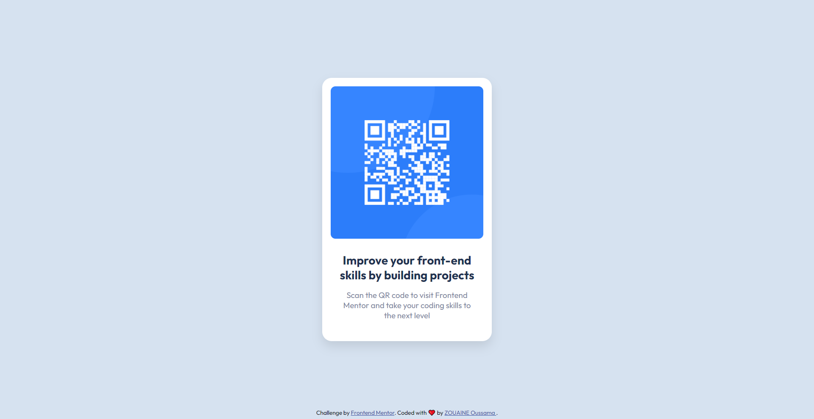

# Frontend Mentor - QR code component solution

This is a solution to the [QR code component challenge on Frontend Mentor](https://www.frontendmentor.io/challenges/qr-code-component-iux_sIO_H). Frontend Mentor challenges help you improve your coding skills by building realistic projects.

## Overview

### Screenshot

### Links

-   Solution Repo: [Solution file](https://github.com/OussamaZouaine/Front-end-mentor-challenges/tree/main/qr-code-component-main)
-   Site Preview: [The live site](https://oussamazouaine.github.io/Front-end-mentor-challenges/qr-code-component-main/index.html)
